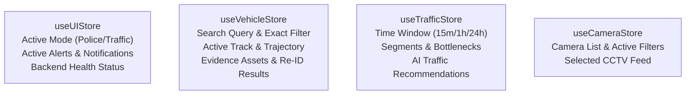

# ZyroTrace AI — Next.js Enterprise Prototype Master Blueprint

> **Project Title**: ZyroTrace AI — Sovereign Multi-Camera ANPR Telemetry & Urban Traffic Intelligence Platform  
> **Target Event**: Smart India Hackathon (SIH) Prototype  
> **Institutional Context**: Bharat Electronics Ltd (BEL) · Ministry of Road Transport & Highways (MoRTH) · Smart Cities Mission  
> **Production Tech Stack**: Next.js (App Router, TypeScript) + Tailwind CSS + Zustand + TanStack Table (v8) + Leaflet Cartography

---

## 1. Architectural Overview & System Stack

This document serves as the **authoritative, self-contained specification** for building the ZyroTrace AI frontend. Any AI agent or developer reading this blueprint has complete, unambiguous instructions to implement the entire application from UI components to state management and API integration.

```
┌────────────────────────────────────────────────────────────────────────────────────────┐
│                               NEXT.JS APP ROUTER (TypeScript)                          │
├────────────────────────────────────────────────────────────────────────────────────────┤
│  UI & Aesthetics: Tailwind CSS (Sovereign GovTech Design Tokens)                       │
│  Typography: Rajdhani (Headers) + Plus Jakarta Sans (UI) + JetBrains Mono (Telemetry)  │
│  State Management: Zustand Stores (VehicleStore, TrafficStore, CameraStore, UIStore)   │
│  High-Density Grids: TanStack Table v8 (Hotlist, History, Cameras, Traffic Segments)   │
│  GIS / Maps: React-Leaflet / Custom SVG Cartography with Animated Corridors            │
│  API Communication: Unified Axios / Fetch Client targeting FastAPI Backend             │
└───────────────────────────────────────────┬────────────────────────────────────────────┘
                                            │ HTTP / REST
                                            ▼
┌────────────────────────────────────────────────────────────────────────────────────────┐
│                      ZYROTRACE FASTAPI BACKEND (OpenAPI / api.json)                    │
│  Cameras (CRUD) · Jobs (Video Pipeline) · Traffic Analytics · ANPR & Re-ID Embeddings  │
└────────────────────────────────────────────────────────────────────────────────────────┘
```

---

## 2. Sovereign GovTech Design System Specification

### 2.1 Color Palette & CSS Variables

Add the following tokens to `tailwind.config.ts` and `app/globals.css`:

```css
:root {
  /* Canvas & Paper Surfaces */
  --bg-porcelain: #FBFBFA;     /* Primary light canvas (anti-glare warm paper) */
  --bg-surface:   #FFFFFF;     /* Card & panel surface */
  --bg-tint:      #F4F4F0;     /* Muted backgrounds, telemetry pill wells, inputs */
  --border-warm:  #E5E2DC;     /* 1px precision container borders */
  --border-subtle:#EEECE6;     /* Secondary dividers and internal gridlines */

  /* Primary Imperial Navy Typography & Elements */
  --navy-950:     #0A192F;     /* Brand titles, high-contrast headers, dark badges */
  --navy-900:     #0F1E36;     /* Card headings, primary button backgrounds */
  --navy-800:     #112240;     /* Navigation bar background, active tab highlights */
  --slate-700:    #334155;     /* Body text, metadata descriptors */
  --slate-500:    #64748B;     /* Secondary labels, breadcrumbs, placeholder text */
  --slate-400:    #94A3B8;     /* Inactive icons, subtle stamps */

  /* Sovereign National & Alert Accents */
  --saffron-600:  #D97706;     /* Indian Amber/Saffron: Hotlist alerts, journey vector */
  --saffron-700:  #EA580C;     /* High-urgency alert banners, felony flags */
  --saffron-50:   #FFFBEB;     /* Amber alert background tint */

  /* Operational Status & Clearance */
  --emerald-700:  #047857;     /* Verified node beacon, normal arterial speeds */
  --emerald-600:  #059669;     /* Active camera status badge */
  --emerald-50:   #ECFDF5;     /* Green clearance pill background */

  --crimson-700:  #B91C1C;     /* Blacklist hit, overspeed, severe bottleneck */
  --crimson-50:   #FEF2F2;     /* Urgent hit background tint */

  --cobalt-600:   #1D4ED8;     /* HSRP 'IND' emblem strip, VAHAN sync badge */
  --cobalt-50:    #EFF6FF;     /* Blue system pill background */
}
```

### 2.2 Typography Hierarchy

Import Google Fonts in `app/layout.tsx`:

```html
<link rel="preconnect" href="https://fonts.googleapis.com">
<link rel="preconnect" href="https://fonts.gstatic.com" crossorigin>
<link href="https://fonts.googleapis.com/css2?family=JetBrains+Mono:wght@400;500;600;700&family=Plus+Jakarta+Sans:wght@400;500;600;700&family=Rajdhani:wght@500;600;700&display=swap" rel="stylesheet">
```

- **Headings & Badges (`font-heading`)**: `'Rajdhani', sans-serif`
  - Used for: Brand title, card category headers, telemetry stamps (`SYS.2612 // LIVE`), mode switcher, camera tags.
  - Characteristics: Uppercase, letter-spacing `+0.04em`, semi-bold (600/700).
- **UI Body & Controls (`font-sans`)**: `'Plus Jakarta Sans', sans-serif`
  - Used for: Form controls, table text, filter dropdowns, advisory recommendations, tooltips.
- **Data & Registration Plates (`font-mono`)**: `'JetBrains Mono', monospace`
  - Used for: Numbers, timestamps in IST, coordinates, speed metrics (`78 km/h`), and vehicle license numbers.
  - Enable tabular numerals: `font-feature-settings: 'tnum' 1;`.

---

## 3. Custom Component Specifications

### 3.1 Authentic Indian HSRP (High Security Registration Plate) Badge

Every vehicle plate rendered across search results, live CCTV frames, tables, and dossiers **must** render using this dedicated HSRP component.

```tsx
// components/ui/HsrpPlate.tsx
interface HsrpPlateProps {
  plateText: string;
  size?: 'sm' | 'md' | 'lg';
  variant?: 'private' | 'commercial' | 'ev'; // white, yellow, green plate
}

export function HsrpPlate({ plateText, size = 'md', variant = 'private' }: HsrpPlateProps) {
  const bgColors = {
    private: 'bg-white text-slate-900 border-slate-800',
    commercial: 'bg-amber-300 text-slate-950 border-amber-500',
    ev: 'bg-emerald-600 text-white border-emerald-700',
  };

  return (
    <div className={`inline-flex items-stretch border-2 rounded-sm shadow-sm overflow-hidden font-mono font-bold tracking-wider ${bgColors[variant]}`}>
      {/* Left Sovereign Blue Strip */}
      <div className="bg-[#003399] text-white flex flex-col items-center justify-between px-1.5 py-0.5 select-none">
        <span className="text-[7px] text-amber-300">☸</span>
        <span className="text-[8px] font-black tracking-tighter">IND</span>
      </div>
      {/* Embossed Registration Text */}
      <div className="px-2.5 py-0.5 flex items-center justify-center text-center uppercase tracking-widest text-sm font-extrabold">
        {plateText}
      </div>
    </div>
  );
}
```

---

### 3.2 Tactical CCTV Optical HUD Player Component

Renders a live or recorded camera stream with military/police optical telemetry overlays:

```tsx
// components/police/CctvHudPlayer.tsx
// Features:
// 1. Top Bar: [CAM-26 // GT KARNAL RD NH-44] [LIVE 1080p // 30 FPS] [🔴 REC]
// 2. Corner Brackets: L-shaped optical reticle lines at each viewport corner
// 3. Central HUD Crosshairs: Subtle center-point targeting guides
// 4. Bounding Box Rendering: Scaled SVG overlay outlining detected vehicle
// 5. Detection Tag: Anchored chip showing [DL 01 AB 1234 · 98.4% CONF · 64 KM/H · WHITE SEDAN]
// 6. Watermark Footer: Real-time IST Digital Clock with milliseconds (e.g. 2026-09-29 14:32:04.812 IST)
```

---

### 3.3 High-Precision Cartography Component (`React-Leaflet`)

- **Base Map**: Light high-contrast CartoDB Positron / OpenStreetMap Light tiles styled to match the warm porcelain canvas (`filter: sepia(0.08) contrast(1.05)`).
- **Camera Junction Nodes**: Custom SVG circle markers (`Navy #0A192F` with white ring and active camera beacon).
- **Suspect Journey Trajectory**:
  - Animated dashed vector polyline in Sovereign Saffron (`#D97706`).
  - Waypoint sequential numbering (`1`, `2`, `3`, `4`).
  - Speed heatmap segments (Green `< 50 km/h`, Saffron `50–80 km/h`, Crimson `> 80 km/h`).
- **Interactive Popup**: Clicking a node opens a preview with camera name, detection timestamp, speed, and cropped plate thumbnail.

---

## 4. Complete Application Structure (Next.js App Router)

```
frontend/
├── app/
│   ├── layout.tsx                    # Master layout (Fonts, QueryProvider, Toast)
│   ├── page.tsx                      # Root page (Redirects to /police)
│   ├── police/
│   │   └── page.tsx                  # Police Surveillance & Hotlist Command Center
│   ├── traffic/
│   │   └── page.tsx                  # Urban Traffic Intelligence & CO2 Advisory
│   ├── cameras/
│   │   └── page.tsx                  # Camera Registry & RTSP Stream Management
│   ├── jobs/
│   │   └── page.tsx                  # Video Processing Jobs Pipeline Monitor
│   ├── globals.css                   # Tailwind base, tokens, animations
├── components/
│   ├── layout/
│   │   ├── Header.tsx                # Institutional BEL/MoRTH C4I Command Bar
│   │   └── SubNav.tsx                # Breadcrumbs, Active Filters, System Clock
│   ├── ui/
│   │   ├── HsrpPlate.tsx             # Authentic Indian HSRP registration plate
│   │   ├── TelemetryBadge.tsx        # High-precision tabular status pill
│   │   ├── MetricCard.tsx            # KPI stat card with delta chip
│   │   ├── Modal.tsx                 # Accessible modal dialog
│   │   └── Tabs.tsx                  # Segmented tactical tab switchers
│   ├── police/
│   │   ├── PlateSearchBar.tsx        # Fast fuzzy/exact plate query input
│   │   ├── HotlistAlertBanner.tsx    # Live audio/visual suspect banner
│   │   ├── SuspectTrajectoryMap.tsx  # Leaflet map with animated journey polyline
│   │   ├── CctvHudPlayer.tsx         # Video player with reticle and bounding boxes
│   │   ├── EvidenceDossier.tsx       # Cropped plate/vehicle crops + VAHAN extract
│   │   ├── SimilarVehiclesModal.tsx  # Vector Re-ID similarity match comparison
│   │   └── HistoryTable.tsx          # TanStack Table for multi-camera sightings
│   ├── traffic/
│   │   ├── CorridorOverview.tsx      # 4 KPI cards (Volume, Avg Speed, Congestion, CO2)
│   │   ├── CongestionMap.tsx         # Segment-based velocity heatmap
│   │   ├── SegmentTable.tsx          # TanStack Table of highway segments
│   │   ├── TrafficAdvisor.tsx        # AI rerouting and signal optimization advice
│   │   └── HistoryAnalyticsChart.tsx # Historical flow trends
│   └── cameras/
│       ├── CameraGridTable.tsx       # TanStack Table of active camera nodes
│       └── AddCameraModal.tsx        # Form to register new camera node
├── lib/
│   ├── api/                          # Strongly typed API client methods (api.json)
│   │   ├── client.ts                 # Axios / fetch instance with error envelopes
│   │   ├── cameras.ts                # Camera endpoints
│   │   ├── vehicles.ts               # ANPR & Re-ID endpoints
│   │   ├── traffic.ts                # Traffic aggregation endpoints
│   │   └── jobs.ts                   # Video processing job endpoints
│   ├── constants.ts                  # Mock test cases (HR 26 CX 9021, DL 01 AB 1234)
│   └── utils.ts                      # Plate normalizers, IST date formatters
├── stores/
│   ├── useVehicleStore.ts            # Zustand: Search query, selected track, timeline
│   ├── useTrafficStore.ts            # Zustand: Window minutes, segments, camera stats
│   ├── useCameraStore.ts             # Zustand: Camera list, selected camera
│   ├── useJobStore.ts                # Zustand: Video jobs, progress
│   └── useUIStore.ts                 # Zustand: Active mode, notifications, API status
├── types/
│   └── api.ts                        # TypeScript interfaces matching doc.json schemas
├── tailwind.config.ts
└── tsconfig.json
```

---

## 5. API Endpoints Mapping & Data Models

All client methods interact directly with the FastAPI backend specified in `doc.json`. If the backend is offline, the client automatically falls back to high-fidelity mock data.

### 5.1 System Health & Diagnostics
- `GET /health`: Checks system heartbeat (`{ status: "ok" }`).
- `GET /ready`: Readiness probe verifying PostgreSQL & pgvector connectivity.

### 5.2 Cameras Module (`/api/v1/cameras`)
| Method | Endpoint | Query / Body | Response Payload | Description |
| :--- | :--- | :--- | :--- | :--- |
| `GET` | `/api/v1/cameras` | — | `Envelope<Camera[]>` | Retrieves all camera nodes with lat/long and segment IDs |
| `POST` | `/api/v1/cameras` | `CameraIn` | `Envelope<Camera>` | Registers a new physical or virtual camera node |

**`Camera` TypeScript Interface**:
```ts
export interface Camera {
  id: string;                    // e.g. "cam-26"
  name: string;                  // e.g. "Outer Ring Rd // GT Karnal Junction"
  latitude: number;              // e.g. 28.7041
  longitude: number;             // e.g. 77.1025
  location_label: string;        // e.g. "North Delhi Corridor"
  road_segment_id: string | null;// e.g. "seg-nh44-n"
  is_active: boolean;            // true
  created_at?: string;
}
```

---

### 5.3 Vehicle ANPR & Re-ID Module (`/api/v1/vehicles`)
| Method | Endpoint | Query / Body | Response Payload | Description |
| :--- | :--- | :--- | :--- | :--- |
| `GET` | `/api/v1/vehicles/search/plate` | `q` (string), `exact` (bool), `limit` (int) | `{ success: true, data: VehicleTrack[] }` | Fuzzy or exact search for license plate across all tracks |
| `GET` | `/api/v1/vehicles/{track_id}/history` | `track_id` (int) | `{ success: true, data: VehicleObservation[] }` | Chronological multi-camera sightings with timestamps |
| `GET` | `/api/v1/vehicles/{track_id}/evidence` | `track_id` (int) | `{ success: true, data: EvidenceAsset[] }` | High-res plate crops, full-frame image URLs, bounding boxes |
| `GET` | `/api/v1/vehicles/{track_id}/similar` | `track_id` (int), `limit` (int) | `{ success: true, data: SimilarVehicle[] }` | Vector similarity Re-ID search using pgvector embeddings |

**Vehicle Types**:
```ts
export interface VehicleTrack {
  id: number;
  first_seen_at: string;
  last_seen_at: string;
  primary_plate: string;
  normalized_plate: string;
  confidence: number;
  vehicle_type: 'car' | 'truck' | 'motorcycle' | 'bus';
  vehicle_color?: string;
  is_hotlist?: boolean;
  hotlist_reason?: string;
}

export interface VehicleObservation {
  id: number;
  observation_id: number;
  camera_id: string;
  camera_name?: string;
  observed_at: string;
  plate_text: string;
  confidence: number;
  speed_kmh?: number;
  latitude?: number;
  longitude?: number;
}

export interface EvidenceAsset {
  id: number;
  track_id: number;
  timestamp: string;
  asset_type: 'plate_crop' | 'vehicle_crop' | 'full_frame';
  file_url: string;
  bounding_box: { x: number; y: number; width: number; height: number };
}

export interface SimilarVehicle {
  track_id: number;
  similarity_score: number;       // 0.0 to 1.0 (cosine similarity)
  plate_text: string;
  vehicle_type: string;
  color: string;
  last_seen_at: string;
  thumbnail_url: string;
}
```

---

### 5.4 Traffic Intelligence Module (`/api/v1/traffic`)
| Method | Endpoint | Query / Body | Response Payload | Description |
| :--- | :--- | :--- | :--- | :--- |
| `GET` | `/api/v1/traffic/overview` | `window_minutes` (int) | `Envelope<TrafficOverview>` | City-wide vehicle count, density, flow rate |
| `GET` | `/api/v1/traffic/cameras` | `window_minutes` (int) | `Envelope<CameraTraffic[]>` | Traffic volume & velocity breakdown by camera node |
| `GET` | `/api/v1/traffic/segments` | `window_minutes` (int) | `Envelope<SegmentTraffic[]>` | Aggregate metrics grouped by road corridor/segment |
| `GET` | `/api/v1/traffic/history` | `camera_id`, `segment_id`, `start_time`, `end_time`, `limit`, `offset` | `Envelope<TrafficAggregateRow[]>` | Paginated historical time-series flow records |

**Traffic Types**:
```ts
export interface TrafficOverview {
  window_start: string;
  window_end: string;
  distinct_tracks: number;       // e.g. 524000
  estimated_flow_rate_per_hour: number;
  avg_speed_kmh: number;
  congestion_index: 'low' | 'moderate' | 'high' | 'critical';
  estimated_co2_kg: number;
}

export interface SegmentTraffic {
  road_segment_id: string;
  segment_name: string;
  total_vehicles: number;
  avg_speed_kmh: number;
  congestion_status: 'fluid' | 'heavy' | 'gridlock';
  cameras: Array<{ id: string; name: string; latitude: number; longitude: number }>;
}
```

---

### 5.5 Video Ingestion & Processing Pipeline (`/api/v1/jobs`)
| Method | Endpoint | Query / Body | Response Payload | Description |
| :--- | :--- | :--- | :--- | :--- |
| `POST` | `/api/v1/jobs` | `JobIn` (`{ camera_id, source_file_key }`) | `Envelope<Job>` | Queues video file / stream for ANPR & tracking |
| `GET` | `/api/v1/jobs` | `limit`, `offset` | `Envelope<Job[]>` | Lists all processing jobs with status |
| `GET` | `/api/v1/jobs/{job_id}`| `job_id` (string) | `Envelope<Job>` | Real-time progress, processed frames, detected tracks |

---

## 6. Zustand State Architecture

We implement 4 decoupled, modular stores to manage client state cleanly:



### 6.1 `useVehicleStore.ts`
```ts
import { create } from 'zustand';
import { VehicleTrack, VehicleObservation, EvidenceAsset, SimilarVehicle } from '@/types/api';

interface VehicleState {
  searchQuery: string;
  isExactMatch: boolean;
  searchResults: VehicleTrack[];
  isSearching: boolean;
  selectedTrack: VehicleTrack | null;
  history: VehicleObservation[];
  evidence: EvidenceAsset[];
  similarVehicles: SimilarVehicle[];
  isLoadingTimeline: boolean;

  setSearchQuery: (q: string) => void;
  setIsExactMatch: (exact: boolean) => void;
  searchPlates: (query?: string) => Promise<void>;
  selectTrack: (track: VehicleTrack) => Promise<void>;
  fetchSimilar: (trackId: number) => Promise<void>;
  clearSelection: () => void;
}
```

### 6.2 `useTrafficStore.ts`
```ts
import { create } from 'zustand';
import { TrafficOverview, SegmentTraffic } from '@/types/api';

interface TrafficState {
  windowMinutes: number;
  overview: TrafficOverview | null;
  segments: SegmentTraffic[];
  selectedSegmentId: string | null;
  isLoading: boolean;

  setWindowMinutes: (minutes: number) => void;
  fetchTrafficData: () => Promise<void>;
  selectSegment: (segmentId: string | null) => void;
}
```

---

## 7. TanStack Table High-Density Implementations

TanStack Table (React Table v8) powers all data-heavy surveillance and analytics views with sorting, filtering, and custom cells.

### 7.1 Police Sighting History Table (`components/police/HistoryTable.tsx`)
Columns to define:
1. **Timestamp**: Formatted in IST (`HH:mm:ss · dd MMM`). Sortable.
2. **Camera Node**: Camera name with link to trigger CCTV HUD view (`CAM-26 // GT Karnal`).
3. **Detected Plate**: Rendered via `<HsrpPlate plateText={obs.plate_text} size="sm" />`.
4. **Confidence**: Progress bar + percentage (`98.4%`). Green if `> 90%`, Amber if `70–90%`.
5. **Observed Speed**: Formatted as `64 km/h` with color pill (Green = Normal, Crimson = Overspeed).
6. **Actions**: `View CCTV Frame` and `Focus on Map` icon buttons.

### 7.2 Urban Corridor Segments Table (`components/traffic/SegmentTable.tsx`)
Columns to define:
1. **Corridor Name**: Road segment title (e.g. `Ring Road — AIIMS to Ashram`).
2. **Active Nodes**: Count of camera nodes active in this segment (`6 Nodes`).
3. **Vehicle Volume**: Tabular count with flow trend (`18,420 vehicles / hr`).
4. **Velocity**: Average speed with speed bar (`34 km/h`).
5. **Congestion Status**: Status badge (`Fluid` = Emerald, `Congested` = Saffron, `Gridlock` = Crimson).
6. **Action**: `Inspect Heatmap` button.

---

## 8. Detailed Screen Workflows & Functionality

### 8.1 Mode 01: Police Surveillance & Hotlist Command Center (`app/police/page.tsx`)

```
┌──────────────────────────────────────────────────────────────────────────────────────────────────┐
│ [ SEARCH: DL 01 AB 1234 ] [EXACT MATCH [✓]] [SEARCH BUTTON]  [HOTLIST: HR 26 CX 9021] [UP 16 Z] │
├───────────────────────────────────────────────┬──────────────────────────────────────────────────┤
│ LEFT PANEL: LIVE CCTV OPTICAL HUD (CAM-26)    │ RIGHT RAIL: FORENSIC EVIDENCE DOSSIER            │
│ ┌───────────────────────────────────────────┐ │ ┌──────────────────────────────────────────────┐ │
│ │ CAM-26 // GT KARNAL RD (KM 14.2) [LIVE]   │ │ │ HSRP: DL 01 AB 1234 (SILVER SWIFT DZIRE)     │ │
│ │ ┌───┐                                     │ │ │ CONF: 98.4% · SPEED: 64 KM/H · TYPE: SEDAN   │ │
│ │ │[☸]│ DL 01 AB 1234                       │ │ ├──────────────────────────────────────────────┤ │
│ │ └───┘ (Bounding Box + Reticle)            │ │ │ VAHAN 4.0 REGISTRY EXTRACT:                  │ │
│ │                                           │ │ │ Owner: R. K**** (Masked)                     │ │
│ │ IST: 2026-09-29 14:32:10.420              │ │ │ Status: STOLEN REPORTED (FIR #294/2026)      │ │
│ └───────────────────────────────────────────┘ │ ├──────────────────────────────────────────────┤ │
│ CARTO-TRACE MAP (LEAFLET INTERACTIVE)         │ │ [DISPATCH INTERCEPTOR] [ISSUE E-CHALLAN]     │ │
│ (Node 12 ──> Node 18 ──> Node 26 Saffron Path)│ │ [FIND RE-ID SIMILAR VEHICLES]                │ │
├───────────────────────────────────────────────┴─┴──────────────────────────────────────────────┤
│ BOTTOM: CHRONOLOGICAL MULTI-CAMERA OBSERVATIONS (TANSTACK TABLE)                                 │
│ [TIME] [CAMERA] [HSRP PLATE] [CONFIDENCE] [SPEED] [GPS COORDINATES] [ACTION]                    │
└──────────────────────────────────────────────────────────────────────────────────────────────────┘
```

1. **User Action: Hotlist Click or Search**:
   - User clicks `HR 26 CX 9021` or enters plate.
   - `searchPlates(query)` executes against `/api/v1/vehicles/search/plate`.
   - The primary track is selected; parallel calls fetch `/history`, `/evidence`, and `/similar`.
2. **Synchronized Telemetry Updates**:
   - The **Cartography Map** animates a saffron vector trace through all camera coordinates where the vehicle was captured.
   - The **CCTV Player** loads the high-resolution frame from the latest sighting, draws the bounding box, and displays optical reticles.
   - The **Evidence Dossier** shows the cropped license plate alongside the vehicle body crop.
3. **Vector Re-ID Similarity Modal**:
   - Clicking `[FIND RE-ID SIMILAR VEHICLES]` opens a comparison modal showing vehicles with similar visual embeddings (useful when a suspect switches false plates or plates are obscured by mud/night glare).

---

### 8.2 Mode 02: Urban Traffic Intelligence & Advisory (`app/traffic/page.tsx`)

1. **Corridor KPI Stat Strip**:
   - Total Monitored Vehicles (24h Window): `524,000` (`+3.1%` trend).
   - Average Arterial Velocity: `38.2 KM/H`.
   - Active Critical Bottlenecks: `3 Corridors` (`Ashram, Dhaula Kuan, ITO Crossing`).
   - Estimated CO₂ Idling Emissions: `142 Metric Tons`.
2. **Segment-Level Velocity Heatmap**:
   - Visualizing real-time traffic flow across Ring Road, Outer Ring Road, and Delhi-Noida Direct (DND) Flyway.
   - Color coding: Emerald (`> 50 km/h`), Saffron (`25–50 km/h`), Crimson (`< 25 km/h`).
3. **AI Smart City Advisory Engine**:
   - Dynamically generated guidance based on ANPR corridor congestion:
     - *Advisory 01: Divert heavy 3+ axle freight trucks to Outer Bypass between 17:00 and 20:30.*
     - *Advisory 02: Extend Phase-2 green signal by 35s on Mathura Road Southbound to drain Ashram tailback.*
     - *Advisory 03: Projected impact: −18% travel delay, −15% fuel wastage.*

---

## 9. Next Steps & Execution Instructions for Builder Agent

When executing this plan:

1. **Scaffold Next.js App**:
   ```bash
   npx create-next-app@latest frontend-next --typescript --tailwind --app --eslint
   cd frontend-next
   npm install zustand @tanstack/react-table lucide-react leaflet react-leaflet clsx tailwind-merge axios
   npm install -D @types/leaflet
   ```
2. **Apply Design Tokens**:
   - Copy the CSS variables into `app/globals.css`.
   - Configure font families (`Rajdhani`, `Plus Jakarta Sans`, `JetBrains Mono`) in `tailwind.config.ts`.
3. **Build Core Components**:
   - Build `HsrpPlate.tsx`, `CctvHudPlayer.tsx`, `TelemetryBadge.tsx`, and `Header.tsx`.
4. **Setup Zustand Stores**:
   - Implement `useVehicleStore.ts` and `useTrafficStore.ts` with mock fallback datasets.
5. **Connect Backend API**:
   - Configure `lib/api/client.ts` pointing to `http://localhost:8000` (or `http://localhost:8080`).
6. **Verify Features**:
   - Test plate search for `HR 26 CX 9021` and `DL 01 AB 1234`.
   - Verify trajectory map polylines and TanStack Table sorting/filtering.
